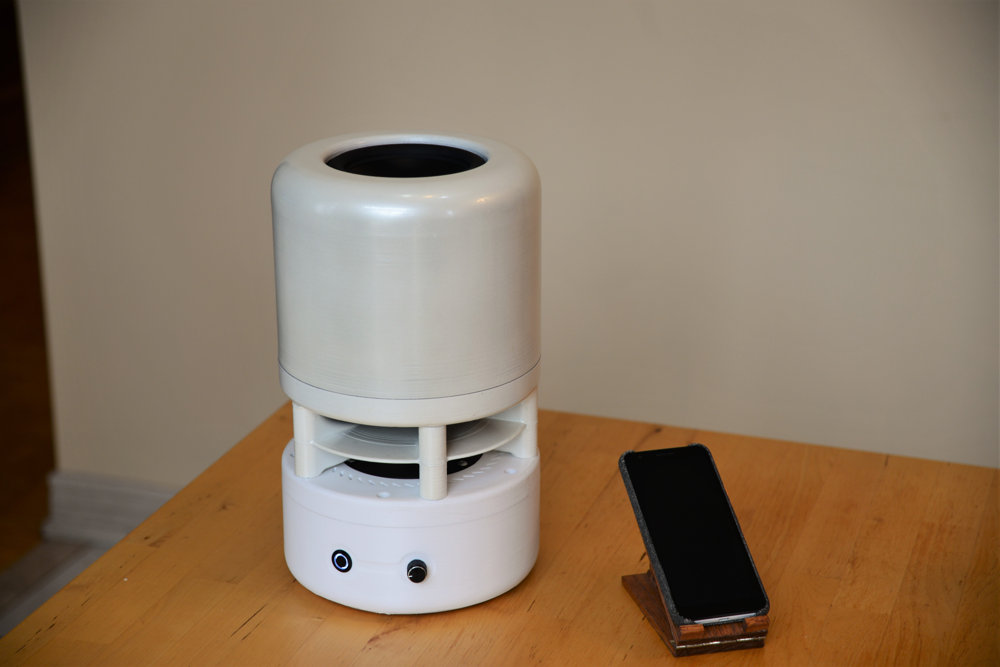
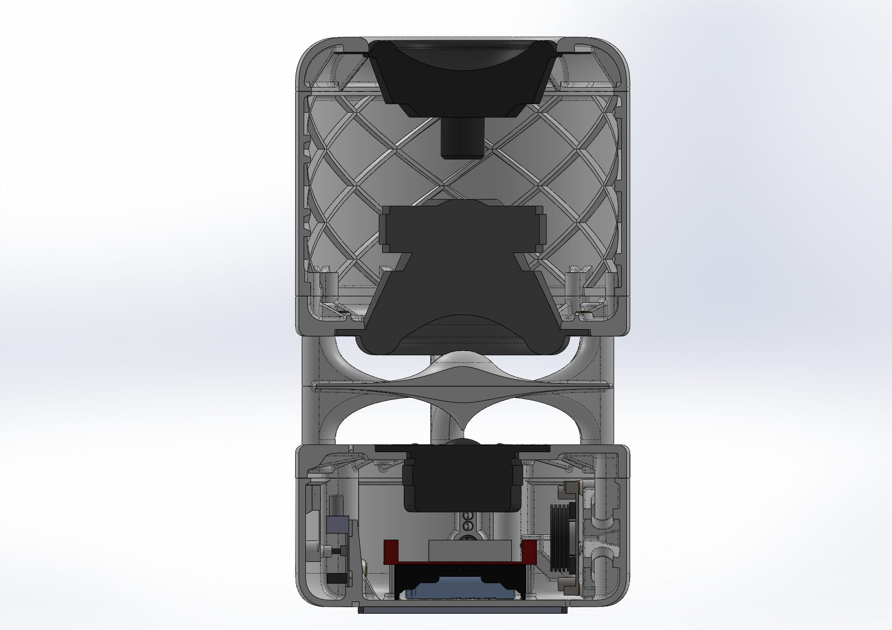

# BluetoothSpeaker
A diy omnidirectional bluetooth speaker.

# Features
- 2-Way speaker with passive radiator design for bass response down to 40 Hz
- Woofer: Tang Band W5-1138SMF 5" Paper Cone Subwoofer
- Tweeter: Dayton Audio DC28F-8 1-1/8" Silk Tweeter
- DSP equalizer for tuned frequency response and FIR crossover for phase coherence
- Omnidirectional radiaton pattern for consistent sound in different rooms/environments
- Battery Powered with Battery Level indicator
- Charging via USB-C PD

# Gallery

